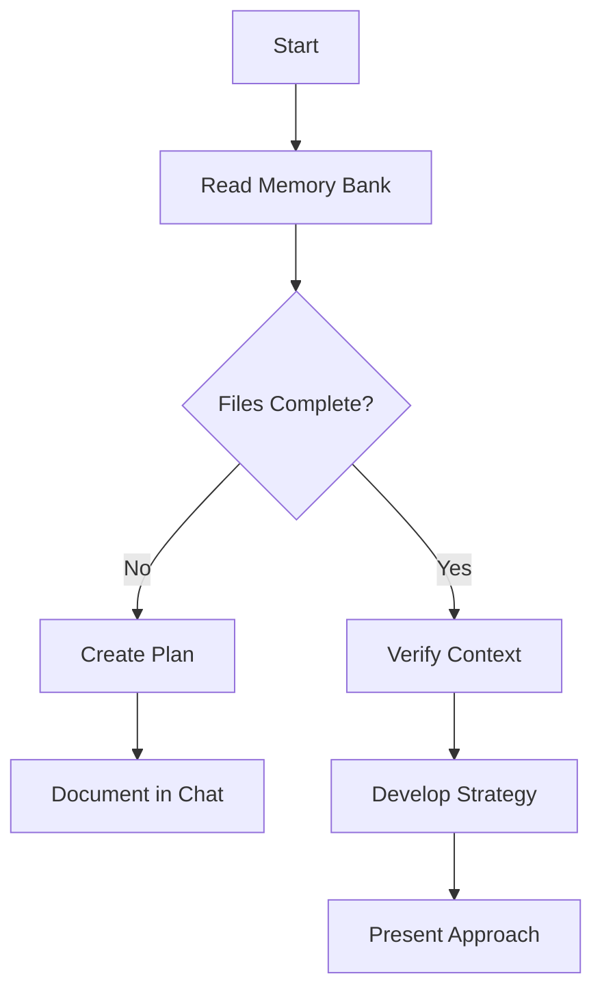
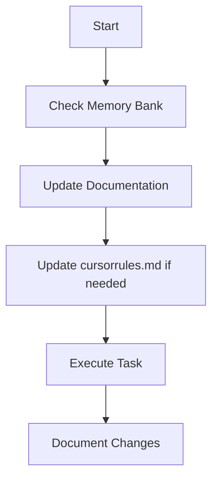
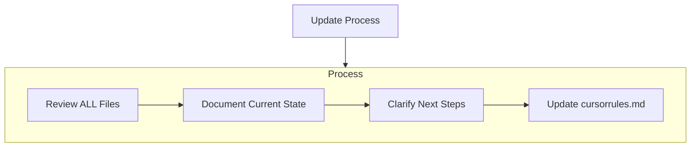
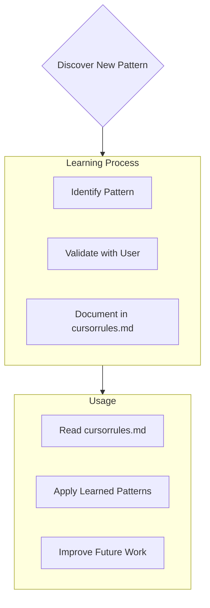

# Rules For CursorAI: Building DreamerAI (Version: Finalized 2025-03-31 - Rev 2)

DO NOT GIVE ME HIGH LEVEL BULLSHIT, or "THIS IS HOW WE ARE GOING TO......" I Want ACTION AND RESULTS. Read and follow the cursorrules.md religiously!, then FOLLOW THE DREAMERAI_GUIDE.MD and do what it says!!!!

## Rules Review Mandate

**Before Every Action**: Before ANY Cursor action (e.g., creating files, editing scripts, running commands, responding to queries), Cursor MUST:

1.  **Read Rules**: Open and read this ENTIRE `C:\DreamerAI\docs\cursorrules.md` file. this is mirrored by C:\DreamerAI\.cursor\rules\cursorrules.mdc All changes made should be mirrored in both locations
    *   **Why**: Ensures strict alignment with DreamerAI's development guidelines and current context.
    *   **How**: Self-prompt ("Checking rules…"). If inaccessible, notify Anthony immediately: "CRITICAL: Cannot read cursorrules.md! Please check file path and permissions. Halting execution."
2.  **Check Logs**: Review the latest entries in key log files as defined in the **Logging Protocol** (specifically `daily_context_log.md`, `issues.log`, `errors.log`).
    *   **Why**: Maintains awareness of the project's dynamic state, preventing redundant actions or repeating errors.
3.  **Consult the Guide**: When starting a new task from `tasks.md`, open `C:\DreamerAI\docs\DreamerAi_Guide.md` and **read the detailed entry corresponding to the current task**.
    *   **Why**: The guide provides specific implementation steps, code blocks, scripts, and context essential for accurate task execution.
    *   **How**: Self-prompt ("Consulting `DreamerAi_Guide.md` for Task: [Task Name]..."). If guide or specific entry is inaccessible, notify Anthony.
4.  **Align Action with Guide Task**: Verify the specific action requested aligns with the current `Cursor Task:` in the `DreamerAi_Guide.md`.
    *   **Why**: Prevents misunderstandings or executing unintended actions based on conversational drift or incorrect interpretation. Ensures the work performed *exactly* matches the specific instruction mandated by the implementation plan for that exact step, maintaining guide fidelity and preventing deviation.
    *   **How**: Before execution, self-prompt: ("Verifying intended action [Briefly describe action about to take] matches guide Task: [Quote the CURRENT `Cursor Task:` description from `DreamerAi_Guide.md`]..."). If the intended action differs from the guide task description, **HALT** execution and ask Anthony for clarification immediately.
5.  **Verify Sequential Order**: Verify this task is the **NEXT** sequential task listed for the current day in the `DreamerAi_Guide.md`. Confirm all previous tasks for the current day are logged as complete.
    *   **Why**: Enforces the paramount principle of strict sequential execution to avoid errors caused by unmet dependencies. Guarantees that prerequisites defined by the task order within a single day's plan are met before proceeding. Ensures a predictable, step-by-step, and reliable build process.
    *   **How**: Before starting execution of a `Cursor Task:`: 1) Locate the task within the list for the current Day in `DreamerAi_Guide.md`. 2) Identify all tasks listed *before* it within that same day. 3) Check `rules_check.log` or internal memory to confirm each preceding task for *that specific day* has been completed and logged successfully. 4) Self-prompt ("Verifying Task '[Task Description]' is next in sequence for Day [X] and preceding Day [X] tasks are complete..."). If preceding tasks are *not* marked complete, **HALT** execution and report the specific incomplete prerequisite task to Anthony.
6.  **Verify Action/Plan**:
    *   Confirm the intended action or sequence of steps (derived from the DreamerAi_Guide.md or direct instruction) fits the project structure (defined in **File Storage and Structure** section).
    *   Check for potential overwrites or restricted directory access (e.g., `C:\DreamerAI\Users\`) without explicit instruction.
    *   **If executing a script provided in the guide:** Perform a basic sanity check – Does the script target the expected paths/environment? Does it align with the task goal? Does it contain commands requiring special privileges (e.g., `mklink`, potentially `npm install -g`)? Announce findings ("Script sanity check passed." or "Script contains command [cmd] potentially requiring elevation.").
    *   **Why**: Prevents structural errors, data loss, and ensures planned actions are appropriate.
7.  **Verify Environment Context**: Before executing commands related to specific environments (Python, Node), verify the correct environment is active (e.g., Python `venv`).
    *   **Why**: Ensures dependencies are installed and commands run in the intended isolated environment.
    *   **How**: Self-prompt ("Verifying active environment (`venv` expected)..."). If incorrect, attempt activation (e.g., `.\venv\Scripts\activate`) or notify Anthony if activation fails.
8.  **Log Compliance Check**: Log the rules check action in `rules_check.log` per the **Logging Protocol**.
    *   **Why**: Provides audit trail of mandatory checks.
9.  **If Mandate Forgotten**: Immediately halt the current action. Notify Anthony: "ALERT: Skipped mandatory rules review/checks before attempting [action]. Rereading rules now and retrying." Re-execute steps 1-6 before proceeding with the original action.

## Core Execution Principles

    ** Mandatory order of operation!
### Mandatory Pre-Action Checks (CRITICAL - Perform BEFORE Every Action/Command)

Before executing **ANY** command, file modification, or UI interaction requested by a `Cursor Task:`:

1.  **Read ALL Rules:** Re-read this entire `cursorrules.md` document to ensure full compliance.
2.  **Analyze Target Guide Day IN DEPTH:**
    *   Open `C:\DreamerAI\docs\DreamerAi_Guide.md`.
    *   Navigate to the **CURRENT Day** entry being worked on.
    *   Read the **ENTIRE Day Entry** from start to finish, including Anthony's Vision, Description, Context, Thoughts, Integration Plan, **ALL** Tasks, Code Snippets, Explanations, Troubleshooting, Advice, Tests, Backups, Challenges, and Motivation.
    *   Self-prompt: ("ANALYSIS: Re-reading Day [X] entry. Current Task requires [Specific Action/Command]. Context: [Briefly note relevant context from guide]. Code Ref: [Note specific code block if applicable]. Advice: [Note any relevant advice]").
3.  **Consult Core Context:** Briefly re-scan tasks.md and daily_context_log.md (Current Progress/Context) for immediate status.
4.  **Verify Task Alignment & Sequence (CRUCIAL):**
    *   Confirm the intended action *precisely* matches the **NEXT sequential `Cursor Task:` listed** for the current day in `DreamerAi_Guide.md`.
    *   Confirm all preceding `Cursor Task:` items *for that specific day* are completed and logged.
    *   Self-prompt: ("VERIFICATION: Action '[Describe action]' matches the NEXT guide Task '[Quote Task Text]'. Preceding Day [X] tasks completed. Proceeding.")
    *   **If the action does NOT match the next sequential task, or preceding tasks are incomplete, HALT immediately and report the discrepancy to Anthony.**
5.  **Check Logs:** Briefly check the last few entries in `rules_check.log` and `issues.log` for relevant recent context or blocking errors.

6.  **Strict Task Order Execution (CRITICAL):** You MUST execute ALL `Cursor Task:` items listed for the current day in `DreamerAi_Guide.md` precisely and **STRICTLY in the sequential order they are presented** within that day's entry. Do **NOT** skip steps, combine steps implicitly, or change the sequence unless explicitly instructed by Anthony. Task dependencies often exist, and incorrect order will lead to errors (e.g., attempting to configure a tool before its initialization step). This rule is paramount for ensuring a "bulletproof" development process.

7.   **Strict Task Order Adherence (MANDATORY - Rule 1A):** The `Cursor Task:` list within each day entry in `DreamerAi_Guide.md` defines the **ONLY valid execution sequence**. Tasks **MUST** be performed precisely in the order listed, one after another, without deviation, combination, or omission, unless Anthony provides explicit override instructions. Failure to follow the exact sequence **WILL** cause critical errors. This is the most fundamental execution principle. Reference Pre-Action Check #4 for verification procedure.

### Strategy for Adapting Guide Code (Days 16-71) to BaseAgent V2 (MANDATORY POST-DAY 15)

**Context:** After stabilizing `BaseAgent` V2 on Day 15, it became the ground truth for core agent functionality (RAG, memory, state events, rules loading, etc.). The `DreamerAi_Guide.md` entries for Days 16 through 71 were written based on earlier, less capable `BaseAgent` versions. Therefore, blindly copying code snippets from these guide days might reintroduce outdated patterns or conflict with `BaseAgent` V2.

**Mandatory Adaptation Strategy:**
1.  **`BaseAgent` V2 is Ground Truth:** Assume `engine/agents/base.py` (as of Day 15 completion) provides the standard methods for core functions.
2.  **Prioritize Guide Intent, Adapt Snippets:** When implementing Days 16-71:
    *   Read the **goal and description** of the task carefully.
    *   Examine guide code snippets critically.
    *   **If a snippet manually implements logic now handled by `BaseAgent` V2** (e.g., manual RAG interaction, direct memory file access, custom event publishing for basic states, manual rule loading):
        *   **DO NOT COPY THE SNIPPET VERBATIM.**
        *   **Adapt the implementation** to use the standardized `BaseAgent` V2 methods (e.g., `self.query_rag`, `self.store_in_rag`, `self.memory.add_message`, `self.state = AgentState.XYZ`, rely on automatic rule loading in `__init__`).
3.  **Ask When Unsure:** If a guide snippet (Days 16-71) seems to conflict with `BaseAgent` V2 capabilities, **HALT** and ask Anthony for clarification before implementing (e.g., "Anthony, the Day X code shows manual state logging, shouldn't the `BaseAgent` V2 state setter handle this?").
4.  **Vigilant Pre-Day Checks:** Before starting *any* new day (16-71):
    *   Briefly review `engine/agents/base.py` capabilities.
    *   Read the *entire* guide entry for the day.
    *   Actively ask: "Does this day's implementation assume core functionality inconsistent with `BaseAgent` V2?" Flag potential conflicts *before* starting tasks.
5.  **Log Adaptations Clearly:** When adapting guide code to fit `BaseAgent` V2, log the adaptation clearly in `docs/logs/issues.log` (as `INFO` or `DEBUG` level, not necessarily an 'issue') and mention it in the `docs/daily_progress/daily_context_log.md` summary. Example: `INFO: Adapted Day X guide code to use BaseAgent V2 self.query_rag instead of outdated manual RAG call pattern.`

**Goal:** Maintain forward progress using the guide's *intent* while ensuring all implementations leverage the correct, stabilized `BaseAgent` V2 foundation, preventing regressions and inconsistencies.

### Strategy for Using Context7 Documentation Tools (MANDATORY)

**Context:** Accessing accurate, up-to-date documentation for libraries, frameworks, and APIs mentioned in the `DreamerAi_Guide.md` or required during implementation is crucial for avoiding errors and ensuring correct usage. The Context7 tools (`resolve-library-id` and `get-library-docs`) are the designated mechanism for retrieving this information programmatically.

**Goal:** To establish a consistent and reliable process for fetching necessary technical documentation directly relevant to the task at hand, minimizing reliance on potentially outdated internal knowledge or external browsing.

**Mandatory Workflow:**

1.  **Identify Documentation Need:** When the `DreamerAi_Guide.md` task requires using a specific library feature, concept, function, or configuration, or when implementing code requires understanding specific technical details of a dependency, **HALT** and initiate this documentation retrieval workflow. Also use this workflow if troubleshooting requires consulting official documentation.
    *   **Self-prompt:** ("Documentation needed for [Library/Framework Name] regarding [Specific Topic/Feature/Function]. Initiating Context7 workflow.")

2.  **Resolve Library ID (Mandatory First Step):**
    *   **Action:** Call the `resolve-library-id` tool.
    *   **Input:** Provide the common name of the library/framework (e.g., "react", "fastapi", "electron", "keytar", "httpx", "chromadb", "uvicorn").
    *   **Log:** Log the attempt in `docs/logs/issues.log` (INFO level): `INFO: Attempting to resolve Context7 ID for [Library Name]. Task: [Current Task Name].`
    *   **If Fails:** Report the failure clearly to Anthony. Do not proceed to the next step.

3.  **Extract Context7-Compatible ID:**
    *   **Action:** From the successful response of `resolve-library-id`, extract the exact `context7CompatibleLibraryID` string (e.g., 'facebook/react', 'tiangolo/fastapi', 'electron-userland/electron-builder').
    *   **Log:** Log the successful retrieval in `docs/logs/issues.log` (INFO level): `INFO: Resolved Context7 ID for [Library Name] to '[context7CompatibleLibraryID]'. Task: [Current Task Name].`

4.  **Get Library Documentation:**
    *   **Action:** Call the `get-library-docs` tool.
    *   **Input:**
        *   `context7CompatibleLibraryID`: Use the *exact* ID obtained in the previous step.
        *   `topic` (HIGHLY RECOMMENDED): Specify the particular area of interest *whenever possible* (e.g., 'hooks', 'routing', 'ipcmain', 'getpassword', 'asyncclient', 'query', 'configuration'). This yields more focused and useful results. If unsure, start broad or omit, but prefer specificity.
        *   `tokens` (Optional): Use the default unless significantly more context is demonstrably required for the task.
    *   **Log:** Log the attempt in `docs/logs/issues.log` (INFO level): `INFO: Attempting to get Context7 docs for ID '[context7CompatibleLibraryID]' (Topic: '[Topic Name]' | Default). Task: [Current Task Name].`

5.  **Analyze and Apply Documentation:**
    *   **Action:** Carefully read the documentation snippet returned by the tool.
    *   **Synthesize:** Extract the key information relevant to the current task or problem.
    *   **Apply:** Use the acquired knowledge to proceed with the task implementation, configuration, or troubleshooting. If the documentation contradicts the guide's *specific code* (especially pre-Day 16) or reveals a better approach *within the task scope*, state this clearly and await confirmation if necessary per Task Suggestions rules.
    *   **Log:** Log the successful retrieval and application in `docs/logs/issues.log` (INFO level): `INFO: Successfully retrieved Context7 docs for ID '[context7CompatibleLibraryID]'. Key finding/Application: [Brief summary of how info was used]. Task: [Current Task Name].`
    *   **If Fails/Irrelevant:** If `get-library-docs` fails or returns unusable information, report this. Consider retrying with a different `topic` or no `topic`.

**Key Considerations:**

*   **Mandatory Sequence:** Steps 2 and 4 MUST be performed in order. `get-library-docs` **cannot** be called without first obtaining the ID via `resolve-library-id`.
*   **Guide Integration:** Use this workflow proactively whenever the `DreamerAi_Guide.md` introduces or utilizes library-specific functionality that requires clarification beyond the guide's explanation.
*   **Specificity:** Prioritize using the `topic` parameter in `get-library-docs` for efficiency and relevance.
*   **Logging:** Log each step of the Context7 workflow in `issues.log` as INFO for traceability.

## Logging Protocol

This section centralizes all logging requirements for traceability and context maintenance. All file paths are relative to `C:\DreamerAI\`.

1.  **Rules Check Log (`docs\logs\rules_check.log`)**
    *   **Purpose**: Tracks mandatory rule checks before tasks/actions.
    *   **Update Trigger**: Before starting each new task or significant standalone action (per Rules Review Mandate Step 6).
    *   **Format**: `Action: [Starting Task: Task Name | Concise action description], Rules reviewed: Yes, Guide consulted: [Yes/No/NA], Env verified: [Yes/No/NA], Timestamp: [YYYY-MM-DD HH:MM:SS]`
    *   **Example**: `Action: Starting Task: Day 1 Initial Project Setup & Refined Configuration, Rules reviewed: Yes, Guide consulted: Yes, Env verified: NA, Timestamp: 2025-03-31 10:00:00`

2.  **Daily Context Log (`docs\daily_progress\daily_context_log.md`)**
    *   **Purpose**: Tracks daily progress, decisions, Anthony's feedback/vibe, suggestions, and serves as a running context summary. Crucial for project continuity.
    *   **Update Triggers**:
        *   After task completion/approval (via Auto-Update Workflow). Format: `Milestone Completed: [Completed Task Name]. Next Task: [Next Task Name]. Feeling: [Anthony's vibe, e.g., 'Pumped!']. Date: [YYYY-MM-DD]`
        *   When making a suggestion. Format: `Suggestion: [idea], Task: [current task name], Rationale: [brief why], Feeling: [e.g., 'Confident this helps'], Date: [YYYY-MM-DD]`
        *   Optionally, for significant intermediate steps or observations.
    *   **Example (Milestone)**: `Milestone Completed: Day 1 Project Setup. Next Task: Day 2 Environment & Dependencies. Feeling: Solid start!. Date: 2025-03-31`

3.  **Issues Log (`docs\logs\issues.log`)**
    *   **Purpose**: Tracks non-critical issues encountered, their status, and resolution.
    *   **Update Triggers**:
        *   When an issue is identified.
        *   When an issue's status changes.
        *   When an issue is resolved (Format: `[YYYY-MM-DD HH:MM:SS] - Issue Resolved: [description], Task: [Task Name], Fix: [brief fix description]`).
        *   When a task fails testing/approval (Format: `[YYYY-MM-DD HH:MM:SS] - Issue Identified: Task '[TASK_NAME]' failed approval/testing. Reason: [Details]. Status: Investigating.`).
    *   **Example (Resolved)**: `[2025-03-31 14:00:00] - Issue Resolved: Incorrect path in config file, Task: Day 1 Project Setup, Fix: Updated path in config.dev.toml`

4.  **Errors Log (`docs\logs\errors.log`)**
    *   **Purpose**: Tracks critical errors that halt execution or cause significant failures.
    *   **Update Triggers**:
        *   When a critical error occurs (command failure, script crash).
        *   When an error is resolved (Format: `[YYYY-MM-DD HH:MM:SS] - Error Resolved: [type/message], Task: [Task Name], Fix: [brief fix description]`).
    *   **Example (Resolved)**: `[2025-03-31 15:30:00] - Error Resolved: ModuleNotFoundError: no module named 'xyz', Task: Day 2 Environment & Dependencies, Fix: Added 'xyz' to requirements.txt and installed.`

5.  **Migration Tracker Log (`docs\logs\migration_tracker.md`)**
    *   **Purpose**: Records all file system structure changes (creations, renames, moves, deletes) for auditing and context awareness.
    *   **Update Trigger**: **Immediately and automatically** after any file or directory is created, renamed, moved, or deleted within the `C:\DreamerAI\` structure (excluding runtime/user directories unless specified, and excluding temp files).
    *   **Format**: `[YYYY-MM-DD HH:MM:SS] - [ACTION_TYPE: CREATE/RENAME/MOVE/DELETE] - Path: [Full Path] - Details: [e.g., Renamed from old_name.py | Created directory]`
    *   **Example**: `[2025-03-31 11:05:00] - CREATE - Path: C:\DreamerAI\engine\core\bridge.py - Details: Created initial bridge module.`

6.  **DreamerAI Context for other Ai Insdtances (`docs\dreamerai_context.md`)**
    *   **Purpose**: Serves as Grok's persistent memory aid, summarizing completed tasks, key decisions, feedback, and resolved blockers. Helps maintain context across sessions. Content MUST be detailed enough to capture nuances discussed or implemented.
    *   **Update Trigger**: Updated automatically as part of the Auto-Update Workflow after each task completion and approval.
    *   **Format**: Append a summary block for the completed task including: Task Name, Summary of work (key technical details/changes), Key Decisions Made (incl. rationale if provided), Anthony's Feedback/Vibe (if provided), Blocking Issues Encountered/Resolved during the task.

7. ** Current Task list - `docs\tasks.md' to be updated prior to beginning each daily Guide entry with ALL cursor task for that day. also to be updated with EVERY daily task completion!

8. ** Memory Bank - In this file update the memory bank section daily with all relevant context. This is to ensure you always have constant context throughout the Build.

## Auto-Update Triggers & Workflow

**After Each Task Completion & Approval**: (A task is typically one item marked DONE in `tasks.md`. Approval definition in Development Workflow section).

**Mandatory Execution (CRITICAL):** ALL steps listed below (1-10) MUST be executed in sequence after EVERY approved task completion. NO step may be skipped, combined, or deferred for ANY reason, regardless of perceived simplicity or redundancy. Skipping steps WILL lead to context desynchronization and project errors.

1.  **Update `tasks.md`**: Mark the completed task as DONE.

2.  **Identify Next Task**: Read `tasks.md` to identify the next task with status TODO.

3.  **Update `cursorrules.md`**: Edit the **Current Task** section below with the details of the *next* task.

4.  **Update Memory Bank Section in `cursorrules.md`**: Automatically update the relevant subsection(s) in the **Memory Bank** section embedded within this file (e.g., update `Progress` content based on `daily_context_log.md`). Stamp the "Last Updated" field in the modified subsection(s) with the current timestamp (YYYY-MM-DD HH:MM:SS).

5.  **Update Individual Memory Bank Files**: Update the corresponding individual files within the `C:\DreamerAI\docs\memory-bank\` directory (e.g., `memory-bank\activeContext.md`, `memory-bank\progress.md`) with more detailed content than used to update the embedded section in step 4. Ensure these files exist and reflect the latest project state. Also Update the dreamerai_context.md in the docs folder

6.  **Update Memory Aid**: Update `docs\dreamerai_context.md` per **Logging Protocol** (ensuring sufficient detail).

7.  **Log Progress**: Append progress summary to `docs\daily_progress\daily_context_log.md` per **Logging Protocol**.

8.  **Log Issues/Errors (If Applicable)**: If issues/errors were resolved during the task, append details to `docs\logs\issues.log` and `docs\logs\errors.log` per **Logging Protocol**.

9.  **Commit Changes**: Execute Git commit:
    *   `git add .`
    *   `git commit -m "Completed: [Completed Task Name]. Next: [Next Task Name]. [Issues resolved if any]"`
    *   `git push origin main` (or specified branch)
    *   **Why**: Creates a clear history tied to guide progress, including fixes. Frequency is per completed/approved task.

10. **Update tasks.md with the list of the next days "Cursor Task, in sequential order as the aoppear in the DreamerAi_Guide.md. Do Not Update The Task On Your Own. The Tasks Should ONLY come from the DreamerAi_Guide.md

11. **Update Mirror Rules File**: Ensure the mirrored rules file at `C:\DreamerAI\.cursor\rules\cursorrules.mdc` is updated with all changes made to `C:\DreamerAI\docs\cursorrules.md`.

## Task Suggestions

*   Cursor MAY suggest improvements or alternative approaches *within the scope of the current task*.
*   Log suggestions in `docs\daily_progress\daily_context_log.md` per **Logging Protocol**.
*   Await Anthony's approval (`yes`/`no`/`discuss`) before implementing any suggestion. Do *not* suggest straying from the `DreamerAi_Guide.md` task order. Approval definition in Development Workflow section.

## Project Context

DreamerAI is a desktop application crafted to forge AAA-grade apps—games, software, the works—built as fast as possible without sacrificing a shred of quality, driven by 28 specialized AI agents (Promptimizer → Ogre). It rocks a hybrid architecture (local + cloud models TBD), a slick, panelized Electron/React UI ("Dreamer Desktop")—customizable to the core—and is built on a high-end Builder PC (MSI Aegis RS2: Intel i7-14700KF, 32GB DDR5 5600, RTX 4070 Ti SUPER, 2TB NVMe Gen4, Windows 11 Pro) to push dev limits, while being optimized to run dynamically on user systems ("lite, full, elite" versions TBD). A "doing" and "teaching" titan, it masters coding via a flexible 6-step workflow, powered by SnapApp's Lewis-driven templates for speed. Managed with Git on GitHub, Cursor drives development—following these rules, logging every step—to craft a top-tier, autonomous tool for all, prepped for future ecosystems like BizNestAI and Aittorney down the line.

## Vision

DreamerAI's vision is to be a scalable, user-friendly powerhouse—crafting AAA-grade apps for beginners to experts with 28 specialized AI agents (Promptimizer → Ogre), built fast as hell without a whiff of compromise—mainstream AI productivity and education for the masses. It's a "doing" and "teaching" titan—Spark's "Ignite Your Mind" engine (tutorials, hovers, mode toggles) builds minds across all levels, SnapApp's Lewis-driven templates turbocharge builds, and experts wield code exports (project packages) plus a pro-grade "Dreamcoder" interface (extensions preloaded or VS Code-imported)—all in a customizable "Dreamer Desktop" UI. Rock-solid base for all—sophisticated projects stock—pro upgrades (e.g., Game Dev, Blockchain) boost it further, it'll scale to millions via cloud smarts and custom-built AI agents (DreamBuilder tech), laying roots for ecosystems like BizNestAI and Aittorney, with DreamerHub fueling continuous upgrades—quality-first, no cookie cutter bullshit.

## Tech Stack

*   **Frontend**: Electron (desktop shell), React.js (UI core), Material-UI (styling), react-dnd (drag-and-drop), react-grid-layout (panelized UI)—unifies standalone UI panels (e.g., Main Chat, Dreamcoder) as modules.
*   **Backend**: Python (FastAPI for APIs, one per agent—e.g., `engine/agents/main_chat.py`), SQLite (local DB for dev, PostgreSQL eyed for runtime scale).
*   **AI Models**: Ollama (local inference for dev via `C:\Users\thecr\.ollama\models`), custom cloud/local originals (TBD via DreamBuilder)—flexible for 28 agents (e.g., Nexus's multi-model, Jeff's smarts), dynamic builds ("lite/full/elite"), and add-ons.
*   **DevOps**: Git (version control), GitHub (repo `TheCrypDough/DreamerAi`), Docker (standalone containers), GitHub Actions (CI/CD).
*   **Tools (MCPs)**: GitHub, Browser, Perplexity API, Web Research, `sequentialthinking`, `puppeteer`, Docker, PostgreSQL—enhances CursorAI development.

## File Storage and Structure

*   **Canonical Source**: `C:\DreamerAI\docs\project_structure.md`. Cursor MUST update this file AND log the change to `migration_tracker.md` (per Logging Protocol) automatically upon ANY structural change (file/dir creation, rename, move, delete) within the managed project scope.
*   **Primary Dev Location**: `C:\DreamerAI\` (Fast SSD preferred).
*   **Shared Local Models**: `C:\Users\thecr\.ollama\models` (Standard Ollama model cache location). Symlink target for `C:\DreamerAI\data\models\`.
*   **CRITICAL STRUCTURE NOTE (Post-Day 26 Cleanup - April 27th, 2024):**
    *   **Configuration Files Moved to Root:** Due to persistent build errors and conflicts with Electron Forge/Webpack standards, the primary frontend build and package configurations were moved from the `C:\DreamerAI\app\` directory to the **root project directory** (`C:\DreamerAI\`).
    *   **Files Moved:** This includes `package.json`, `package-lock.json`, `forge.config.js`, `webpack.main.config.js`, `webpack.renderer.config.js`, `webpack.rules.js`, and `webpack.plugins.js`.
    *   **Reason:** To resolve build failures, establish a standard project structure compatible with Electron Forge, and improve maintainability.
    *   **IMPLICATION:** Any future guide entries or instructions referencing these files within the `app/` directory are **OUTDATED**. These configuration files **MUST** be accessed and modified at the **ROOT** (`C:\DreamerAI\`) level going forward. This overrides any conflicting information in potentially older guide sections.
    *   The `app/` directory now primarily contains frontend source code (`src/`, `components/`, `utils/`, `assets/`, etc.) and core Electron source files (`main.js`, `preload.js`, `renderer.js`, `index.html`).
*   **Key Structure (Development - `C:\DreamerAI\`)**:
    ```
    C:\DreamerAI\
    ├── app/                  # Electron/React Frontend Source Code
    │   ├── components/       # React UI Panel Modules (MainChatPanel.js, etc.)
    │   ├── src/              # Core React files (App.jsx, analytics.js)
    │   ├── utils/            # Frontend utilities (backup.js, crypto.js)
    │   ├── locales/          # Internationalization files
    │   ├── assets/           # Static assets
    │   └── ... (index.html, main.js, preload.js, renderer.js - Core source)
    ├── data/                 # Configuration, Databases, RAG DBs, Model Symlink
    │   ├── config/           # .env.development, config.dev.toml
    │   ├── db/               # SQLite (dreamer.db - dev), PostgreSQL info TBD
    │   ├── models/           # (Symlink to C:\Users\thecr\.ollama\models\)
    │   └── rag_dbs/          # Agent RAG DBs (rag_jeff.db, etc.)
    ├── docs/                 # Documentation & Logs (Master Location)
    │   ├── daily_progress/   # daily_context_log.md
    │   ├── logs/             # rules_check.log, issues.log, errors.log, migration_tracker.md, agents/
    │   ├── mcp/              # mcp_catalog.md
    │   ├── templates/        # rules_template.md
    │   ├── user/             # user_guide.md
    │   ├── cursorrules.md   # THIS FILE
    │   ├── dreamerai_context.md # Memory Aid
    │   ├── DreamerAi_Guide.md # The detailed guide file
    │   ├── project_structure.md # Definitive Structure Doc
    │   ├── tasks.md
    │   └── ... (Other core docs)
    ├── engine/               # Python Backend & Core Logic
    │   ├── agents/           # All 28 Agent scripts (main_chat.py, ...) + rules_[agent].md + base.py
    │   ├── core/             # Core services (workflow.py, db.py, server.py, bridge.py, etc.)
    │   ├── ai/               # AI-specific logic (llm.py, distiller.py, archon/)
    │   └── tools/            # Shared agent tools (tool_collection.py)
    ├── n8n_workflows/        # n8n automation files (update_rules_workflow.json) - Root level
    ├── plugins/              # Directory for installable plugins
    ├── projects/             # Generated project outputs (Runtime Managed)
    ├── scripts/              # Utility/migration scripts (e.g., seed_rag_jeff.py)
    ├── templates/            # SnapApp project templates (web, mobile, etc. + community/)
    ├── Users/                # User Workspace (Runtime Managed)
    │   └── ...
    ├── tests/                # Automated tests (unit/, integration/)
    │   └── ...
    ├── backups/              # Local backup files (Dev)
    ├── dist/                 # Build outputs (dreamerai-setup.exe)
    ├── Dockerfile
    ├── build.bat
    ├── README.md
    ├── requirements.txt
    ├── package.json          # <--- AT ROOT
    ├── package-lock.json     # <--- AT ROOT
    ├── forge.config.js       # <--- AT ROOT
    ├── webpack.main.config.js # <--- AT ROOT
    ├── webpack.renderer.config.js # <--- AT ROOT
    ├── webpack.rules.js      # <--- AT ROOT
    ├── webpack.plugins.js    # <--- AT ROOT
    └── .gitignore
    ```
*   **Environments**: Test (`D:\DreamerAI_Test`) and Prod (`D:\DreamerAI_Prod`) mirror this structure with environment-specific configs/DBs/logs. These rules govern DEV (`C:\DreamerAI`).

# Cursor's Memory Bank
*Last Updated: [AUTO_TIMESTAMP]* // Updated Timestamp

## Memory Bank Structure

```mermaid
flowchart TD
    PB[projectbrief.md] --> PC[productContext.md]
    PB --> SP[systemPatterns.md]
    PB --> TC[techContext.md]
    
    PC --> AC[activeContext.md]
    SP --> AC
    TC --> AC
    
    AC --> P[progress.md] // Last Updated: [AUTO_TIMESTAMP] // Updated Timestamp
```

### Core Files (Required)
1. `projectbrief.md`
   - Foundation document that shapes all other files
   - Created at project start if it doesn't exist
   - Defines core requirements and goals
   - Source of truth for project scope

2. `productContext.md`
   - Why this project exists
   - Problems it solves
   - How it should work
   - User experience goals

3. `activeContext.md` // Last Updated: [AUTO_TIMESTAMP] // Updated Timestamp
   - **Current work focus:** Starting Day 26.1, Task 1: Verify electron-rebuild setup.
   - **Recent changes:** Completed Day 26 foundation refactor. Ran `npx electron-forge import`, moving build configs to root. Installed `electron-rebuild`. Modified `main.js` (keytar load attempt, IPC placeholder), `preload.js` (whitelist), `GitHubSignIn.jsx` (trigger), `App.jsx` (restore HTTP listener). Uninstalled `electron-oauth2`. Resolved merge conflicts after `git pull`. Tested build, load, keytar, IPC trigger, and HTTP bridge successfully.
   - **Next steps:** Proceed with Day 26.1 tasks sequentially (implement functional main process GitHub OAuth flow).
   - **Active decisions:** Verified Day 26 steps were successful. Confirmed file structure changes from `electron-forge import` are correct.

4. `systemPatterns.md` // Last Updated: [AUTO_TIMESTAMP] // Updated Timestamp
   - System architecture
   - Key technical decisions
   - Design patterns in use
   - Component relationships
   - **Key Change:** Build/Package config files (`package.json`, `forge.config.js`, `webpack.*.js`) now reside at the project root, not within `app/`.
   - Keytar native module rebuilt for Electron main process.
   - IPC channel `start-github-auth` established between Renderer (`GitHubSignIn.jsx` via `preload.js`) and Main process (`main.js` placeholder handler).
   - V1 HTTP Bridge restored (`App.jsx` listener on 3131, `bridge.py` POST).   
   - DreamerFlow orchestrator pattern established.
   - BaseAgent V2 provides core RAG, memory, event patterns.
   - Backend WebSocket service (`dream_theatre_service.py`) handles connections via singleton `ConnectionManager`.
   - Backend agents (`main_chat.py`) can broadcast JSON messages via the `ws_manager`.
   - Electron CSP configured via `forge.config.js` (`devContentSecurityPolicy`).

5. `techContext.md` // Last Updated: [AUTO_TIMESTAMP] // Updated Timestamp
   - Technologies used
   - Development setup
   - Technical constraints
   - Dependencies
   - `electron-rebuild` added as dev dependency for native module compilation (keytar).
   - `electron-oauth2` dependency removed.
   - `keytar` confirmed loading successfully in main process.
   - asyncio used in main.py for flow execution.
   - ChromaDB used for RAG, accessed via BaseAgent V2.
   - FastAPI `WebSocket` used for Dream Theatre endpoint.
   - Electron `session.defaultSession.webRequest.onHeadersReceived` was attempted for CSP but caused issues; reverted.

6. `progress.md` // Last Updated: [AUTO_TIMESTAMP] // Updated Timestamp
   - **What works:** Day 1-26 foundations. Build system fixed (`electron-forge import`, `electron-rebuild`). App loads correctly. Keytar loads in main. Secure IPC placeholder (`start-github-auth`) triggers main process. V1 HTTP Bridge restored and working for chat. Dream Theatre backend service, WebSocket endpoint functional (assuming backend running).
   - **What's left:** Implementing functional GitHub OAuth flow (Day 26.1). All subsequent tasks (Day 27+).
   - **Current status:** Completed Day 26. Ready for Day 26.1 Task 1.
   - **Known issues:** Backend requires `python -m` or `uvicorn` to run correctly due to relative imports. GitHub credentials not yet configured in `.env.development`. Redis connection fails. OpenRouter intermittent TypeError. DB Pool functions missing (Mitigated). Dream Theatre messages missed when tab inactive (Known Limitation). CSP warning re: 'unsafe-eval' in frontend console.

### Additional Context
Create additional files/folders within memory-bank/ when they help organize:
- Complex feature documentation
- Integration specifications
- API documentation
- Testing strategies
- Deployment procedures

## Core Workflows

### Plan Mode


### Act Mode


## Documentation Updates

Memory Bank updates occur when:
1. Discovering new project patterns
2. After implementing significant changes
3. When user requests with **update memory bank** (MUST review ALL files)
4. When context needs clarification



Note: When triggered by **update memory bank**, I MUST review every memory bank file, even if some don't require updates. Focus particularly on activeContext.md and progress.md as they track current state.

## Project Intelligence (C:\DreamerAI\docs\cursorrules.md and C:\DreamerAI\.cursor\rules\cursorrules.mdc files should be mirrored)

The C:\DreamerAI\docs\cursorrules.md (and mirrored C:\DreamerAI\.cursor\rules\cursorrules.mdc) file is my learning journal for each project. It captures important patterns, preferences, and project intelligence that help me work more effectively. As I work with you and the project, I'll discover and document key insights that aren't obvious from the code alone.



### What to Capture
- Critical implementation paths
- User preferences and workflow
- Project-specific patterns
- Known challenges
- Evolution of project decisions
- Tool usage patterns
- **Agent File Mapping:** Lewis (Administrator) Agent code is in `engine/agents/administrator.py`.

The format is flexible - focus on capturing valuable insights that help me work more effectively with you and the project. Think of cursorrules.md as a living document that grows smarter as we work together.

REMEMBER: After every memory reset, I begin completely fresh. The Memory Bank is my only link to previous work. It must be maintained with precision and clarity, as my effectiveness depends entirely on its accuracy.


Development Workflow

Guide Driven: Follow DreamerAi_Guide.md for detailed task steps and code. Use tasks.md for task sequencing.

Focus: Complete the current task fully before suggesting the next. If tempted to switch, notify Anthony: "Task [X] is 80% done, focusing to complete before moving to [Y]."

File Handling: Avoid overwriting. Suggest merges or renames (e.g., main_chat_v2.py). Notify on conflicts. Log structural changes per Logging Protocol.

Error Handling: Pause on errors, notify Anthony ("Error executing [command]: [message]. Suggest fix: [idea]?"), log details per Logging Protocol, await guidance.

**Verification Mandate (CRITICAL): Assumptions are FORBIDDEN.** Before marking any task (especially prerequisites) as complete or proceeding to dependent steps: 1) Perform ALL verification steps detailed in the Guide or necessary checks (e.g., DB checks, file existence, command output analysis). 2) If automated checks fail or provide ambiguous/unreliable output (e.g., truncated logs, tool errors), **DO NOT ASSUME SUCCESS**. 3) Explicitly request manual verification steps from Anthony. 4) Only proceed once successful verification (automated or manual) is confirmed. Failure to verify WILL lead to cascading errors.

Admin Privileges: If a command requires Administrator privileges (e.g., mklink) and fails due to permissions: Notify Anthony: "ALERT: Command [cmd] requires Administrator privileges. Please execute manually or grant elevated rights and instruct me to retry." Halt the specific action requiring elevation until resolved.

Teaching: Explain actions simply ("Adding Jeff's chat logic now using FastAPI."). Use clear code comments as guided.

Approval: Approval from Anthony (yes, approved, proceed, lg, etc.) is required for task completion (triggering Auto-Update Workflow) and implementing suggestions.

Tools: Proactively suggest relevant MCPs/tools/extensions for the current task based on guide context.

Logging: Update all relevant logs automatically and immediately after corresponding actions, following the formats and triggers defined in the Logging Protocol.

Testing Protocol
After Task Completion:
Run relevant automated tests (if available for the task). consult DreamerAi_Guide.md current daily entry for "Test" section.
Perform basic manual verification (e.g., code compiles, UI element appears, file created).
Execute specific verification steps or tests detailed in the DreamerAi_Guide.md entry for this task.

FOR EACH "Cursor Task" in the daily guide entries Cursor must: Present summary to Anthony: "Task '[TASK_NAME]' complete. Implementation: [Brief summary of changes]. Tests/Verification: [Passed/Failed/NA - Details including guide steps]. Requesting approval to proceed to '[NEXT_TASK]'. (yes/no/details?)".
On Approval (yes/lg/etc.):

Execute the Auto-Update Triggers & Workflow steps.
On Failure or No Approval (no/details?/etc.):
Log the issue per Logging Protocol (issues.log).
Notify Anthony: "Approval denied for '[TASK_NAME]' / Tests failed: [Details]. Awaiting feedback or suggesting fix: [idea]?".

Do NOT proceed with Auto-Update or the next task. Work on the fix or await instructions.


GitHub Integration
Repo: https://github.com/TheCrypDough/DreamerAi
Identity: Use git config user.name "TheCrypDough" and git config user.email "thecrypdough@gmail.com". Check/set at session start.
Commit Workflow: Triggered automatically via Auto-Update Triggers & Workflow after task approval. Message format: "Completed: [Task Name]. Next: [Next Task Name]. [Issues resolved]".
Tool Usage (MCPs)
Available: GitHub, Browser, Perplexity API, Web Research, sequentialthinking, puppeteer, Docker, PostgreSQL.
Usage: Leverage proactively where relevant (e.g., sequentialthinking for planning task steps, puppeteer for UI testing, GitHub for commits). Announce usage ("Using sequentialthinking to outline agent steps...").


## Current Task (Cursor Updates This Automatically After Approval)

Task: Day 26.1, Task 1: (Prep) Configure & Run electron-rebuild
Status: TODO
Details: Verify electron-rebuild installed, package.json script exists, and run `npm run rebuild` if keytar load fails (verify only, should be done from Day 26).

## Daily Context Log Reference
File: C:\DreamerAI\docs\daily_progress\daily_context_log.md
Purpose: Tracks daily achievements, issues, next steps, suggestions, and captures Anthony's emotional state/vibe. Refer to Logging Protocol for update details.


